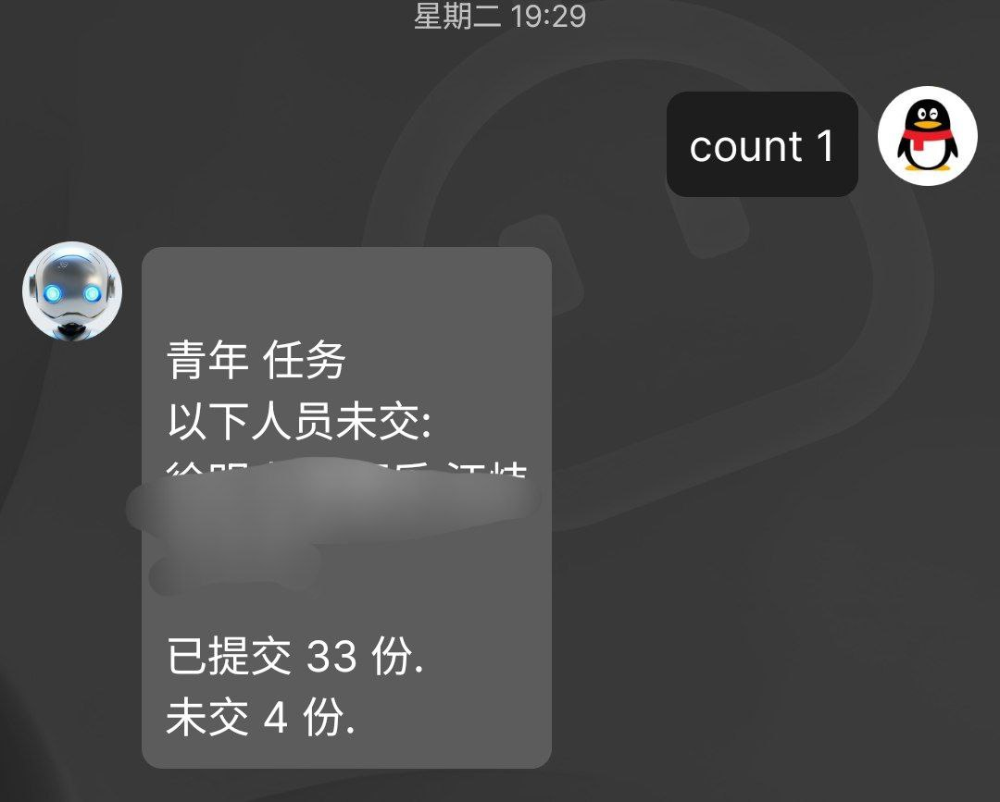
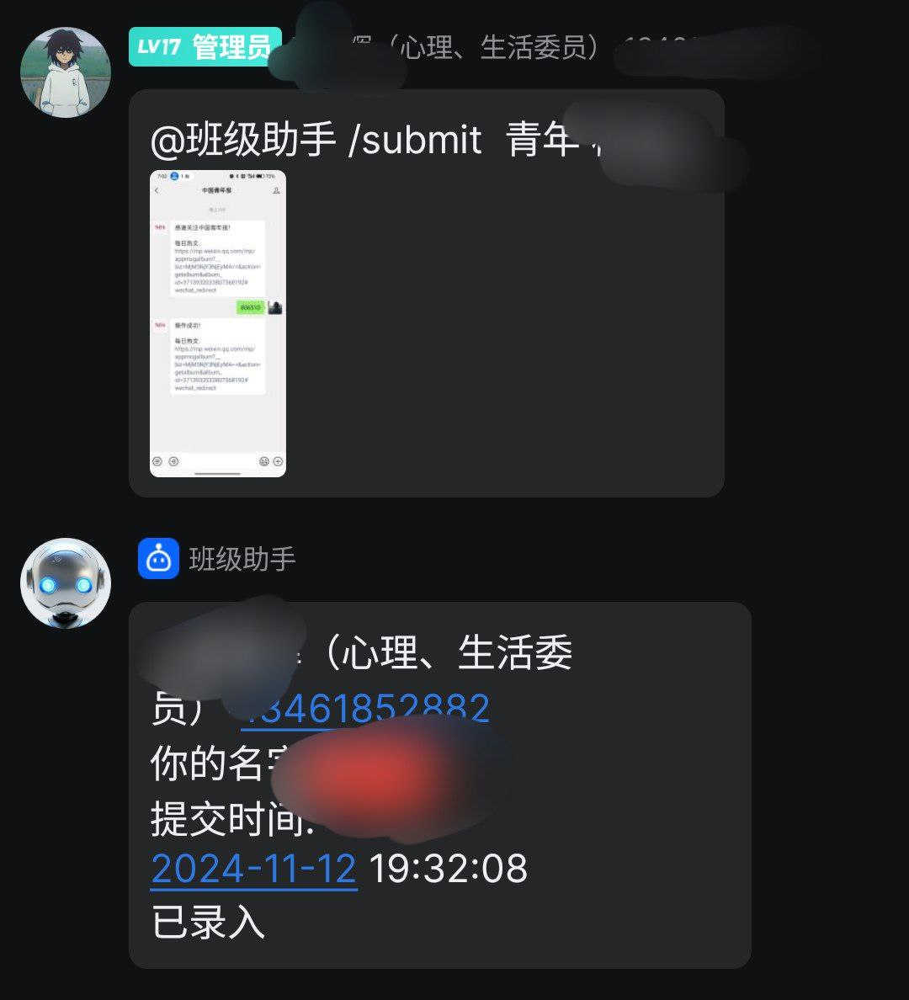

# QQBot-Class
该机器人用于收集各种信息例如截图

# 例子



# 准备工作
## 安装 qq-bot
```bash
pip 安装 qq-botpy
```
## 修改班级名称和班级成员
name 文件夹下新建一个txt文件 例: 导弹维修2408.txt  
导弹维修2408.txt 文本内容为班级内的成员名称  
例如:  
张三  
李四  
王五  
## 修改conf.json 文件以配置QQBot
secret 为 QQ开放平台->QQ机器人管理端->AppSecret (机器人密钥)  
Argentina 为 QQ开放平台->QQ机器人管理端->AppID(机器人ID)
### 修改conf.json 的班级
classroom  为对应班级例:导弹维修2408.txt  

# 使用
```bash
python3 main.py
```
@机器人 /help

# 致谢
https://q.qq.com/  
https://github.com/tencent-connect/botpy

## Star History

[](https://star-history.com/#John-Smiths/QQBot-Class&Date)
